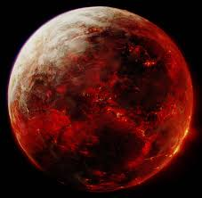
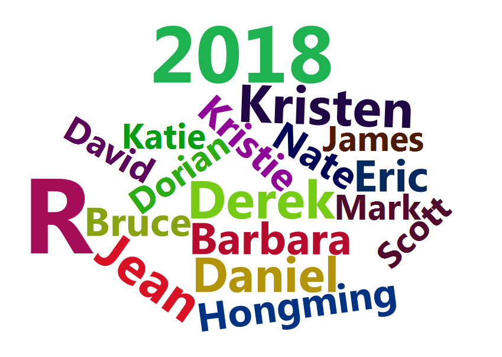

```{r setup, include=FALSE}
library(rmarkdown)
library(tidyverse)
library(knitr)
knitr::opts_chunk$set(echo = TRUE, error = TRUE)
htmltools::tagList(rmarkdown::html_dependency_font_awesome())
```


# Welcome! 
<hr>

{width="260" style="float: left; margin-right: 60px; margin-top: -10px;"}

<br><br>

__Please connect to your droid__

- Open the __Start menu__  (_Click the Windows logo on the bottom left of the screen_)
- Select ` Remote Desktop Connection `
- Enter ` w7-your7digit# ` or ` R32-your7digit# `
- Press _Connect_
- Relax...

<br><br>

# Good morning, Empire minions! 
<hr>

<div class="row3">

<div class="column3" style="border: 0px solid grey;">
</a>
</div>

<div class="column3" style="border: 0px solid grey;">
</a>
</div>

<div class="column3" style="border: 0px solid grey;">
</a>
</div>

</div>

<br>

We are __Barbara__, __Kristie__, __Dorian__, and __Derek__.   

We like __R__.

We are not computer scientists. 

We make lots of mistakes. You will see us make mistakes. Feel free to laugh at us. It's okay. Really.


<br><br>


### You are the great cohort of &nbsp; <span style="font-size: 1.6em;"><i class="fa fa-group" aria-hidden="true" style="color: steelblue;"></i></span> <span style="font-size: 2em;">2018</span><span style="font-size: 1.6em;"><i class="fa fa-group" aria-hidden="true" style="color: steelblue;"></i></span> {-}


```{r wordcloud, include=F, eval=F}
library("yarrr")
library("wordcloud")
library("wordcloud2")
library("dplyr")

set.seed(2)

names <- c("Derek", "Kristie", "Barbara", "Dorian", "Daniel", "Nate", 
           "Kristen", "Mark", "Bruce", "Eric", "Katie", "Hongming", 
           "Jean", "Scott", "David", "James", "R", "2018")

frequency <- c(as.numeric(sample(8:12, 16, replace = T)), 24,18)

pirates <- piratepal("info2") 

wordcloud(names, 
          random.order = F, 
          random.color = TRUE, 
          scale        = c(4,1), 
          freq         = frequency, 
          colors       = pirates, 
          vfont        = c("sans serif","bold"), 
          rot.per      = 0.2,
          size         = 0.1)

wordcloud2(data.frame(word = names, freq = frequency), size = 1, color = 'random-dark')

#letterCloud(data.frame(word = names, freq = frequency), word = "R", color = 'random-light', wordSize = 10)

```

{width=75%}

<br>

You are the all in this together. Use each other as a resource. Share ideas, share code, collaborate. Make bad R jokes.   
<br>

__Here's one:__  _What be the pirate's favorite letter?_

<br>

{width="230"}

<br>

> _Just kidding. You'd think it'd be R, but 'tis the __C__ they truly love._

<br>


### <i class="fa fa-exclamation-triangle" aria-hidden="true" style="color:orange;"></i> Disclaimer 

_Spelling is very important in R._


<br>


# Why R? 

## Data analysis in 7 steps 

> 1. Read the data
> 1. Stare at the data
> 1. Clean the data
> 1. Stare at the data harder
> 1. Summarize the data
> 1. __Share your work__
> 1. Share the results


```{r, include=F, eval=F}
# <div class="alert alert-info"></div>
```


## Data analysis in R

```{r create, include=F, eval=F}
library(readxl)
library(tidyverse)

# Prepare example data
aqs <- read_excel("data/2014_AQS_FondduLac.xlsx") %>%
       mutate(Date = as.Date(Date))

met <- read_csv("data/COQ 2014 Processed MET -ASOS.csv") %>% 
       mutate(Date = as.Date(paste(Year, Month, Day, sep = "-")),
              Month = as.numeric(Month),
              Hour = as.numeric(Hour)) %>% 
       group_by(Date, Month, Day, Hour) %>% 
       summarize(TEMP_F = mean(TempF, na.rm = T))

aqs <- left_join(aqs, met)

aqs <- filter(aqs, Parameter == 88101, !is.na(TEMP_F))

aqs <- rename(aqs, OZONE = Conc, YEAR = Year, SITE = site_catid) %>%
       rowwise() %>%
       mutate(YEAR = 2017 - sample(-1:1, 1),
              Date = as.Date(paste(YEAR, Month, Day, sep = "-")))

aqs <- aqs %>%
       select(SITE, Date, Hour, OZONE, TEMP_F, everything()) %>%
       filter(Month > 3, Month < 11) %>% 
       group_by(SITE, Date) %>%
       mutate(OZONE  = max(OZONE, na.rm = T),
              TEMP_F = max(TEMP_F, na.rm = T)) %>% 
       slice(1)

write_csv(aqs, "data/OZONE_samples.csv")
```


### 1. Read the data

```{r data}
air_data <- read_csv("data/OZONE_samples.csv")
```

```{r tbl, include=F}
air_data %>% sample_n(5) %>% select(SITE, Date, OZONE, TEMP_F) %>% kable()
```


### 2. View the data

```{r view, message = F, fig.width=12, fig.height=4}
ggplot(air_data, aes(x = TEMP_F, y = OZONE)) + 
    geom_point(alpha = 0.2, size = 2) +
    geom_smooth(method = "lm")
```


### 3. Clean the data

```{r clean}
# Drop values out of range
air_data <- air_data %>% filter(OZONE > 0, TEMP_F < 199) 
```


### 4. View the data harder

```{r, fig.width=12, fig.height=4}
ggplot(air_data, aes(x = TEMP_F, y = OZONE)) + 
    geom_point(alpha = 0.2, size = 2) +
    geom_smooth(method = "lm") + 
    facet_wrap(~SITE)
```


### 5. Summarize the data
```{r summary}
air_data <- air_data %>% 
            group_by(SITE, YEAR) %>% 
            summarize(AVG_OZONE = mean(OZONE) %>% round(2),
                      AVG_TEMP  = mean(TEMP_F) %>% round(2))
```

```{r, include=F}
air_data %>% kable()
```


### 6. Share your work

![images/github_example.png]{style="width: 85%;"}


###  7. Share the results

__Save the final data table__
```{r save-csv}
air_data %>% write_csv("results/2015-17_ozone_summary.csv")
```


<br>

__Save the site plot__
```{r save-ch, message=F}
ggsave("results/2015-2017 - Ozone vs Temp.pdf")
```


##
