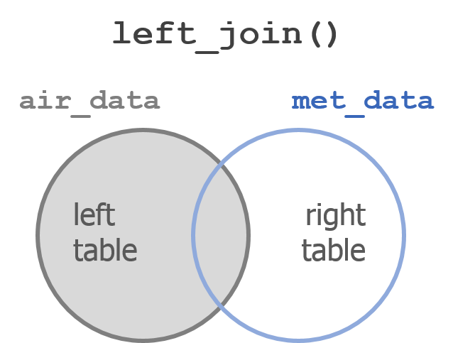
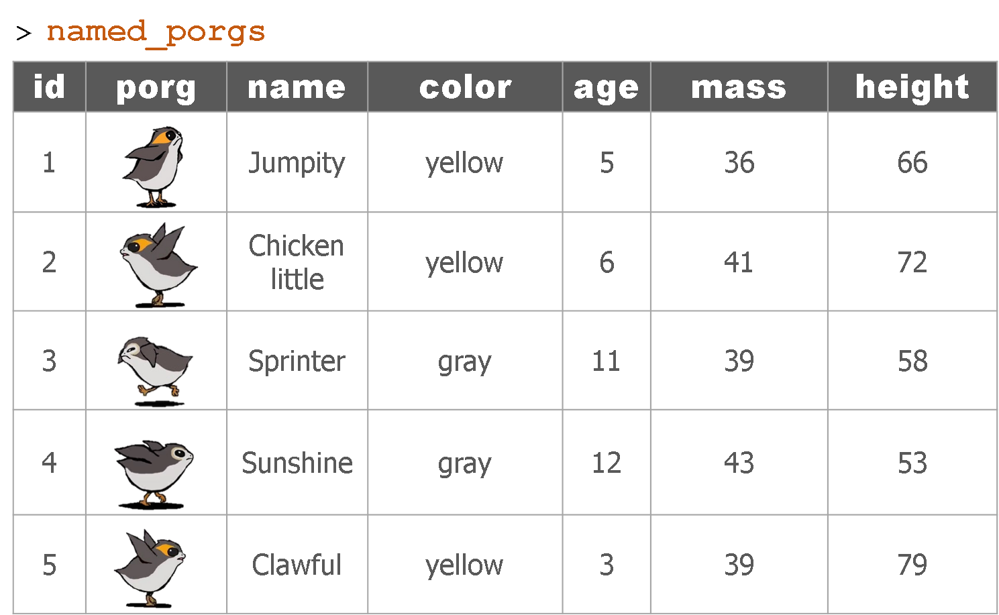
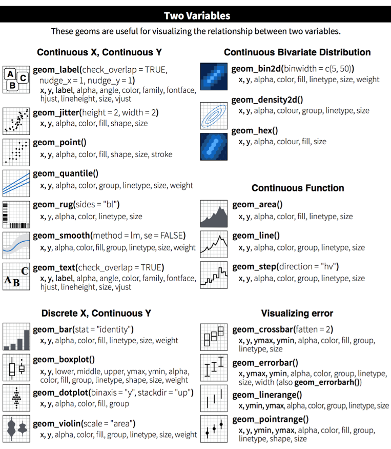

```{r setup, include=F}
knitr::opts_chunk$set(echo = TRUE, warning = F, message = F)
knitr::opts_chunk$set(fig.width = 11, fig.height = 6) 
htmltools::tagList(rmarkdown::html_dependency_font_awesome())
```

# Welcome back Jedis! {-}
<hr>

{width="260" style="float: left; margin-right: 60px; margin-top: -10px;"}

<br><br>

### Please connect to your droid {-}

- Open the __Start menu__  (_Click the Windows logo on the bottom left of the screen_)
- Select ` Remote Desktop Connection `
- Enter ` R32-your7digit# ` or ` w7-your7digit# `
- Press _Connect_

<br>

__Open your RStudio project__

- __Open__ your project folder from last week
- Double click the __.Rproj__ file to open RStudio


## Schedule  {-}

<div class="well">

- Review
- Join 2 tables
- Convert units
- Summarize by group
- `ifelse()`
- In depth plots
    - Set geometries
    - Add geoms
    - Set colors
</div>   
    

## Porg review {-}

The _poggle_ of porgs has returned to help us review the `dplyr` functions. Follow along by downloading the __porg__ data from the URL below.

```{r, eval = F}
library(readr)
porgs <- read_csv("https://itep-r.netlify.com/data/porg_data.csv")
```

<br>

```{r porg-tabs, results='asis', echo=F}
cat(readLines("porg_tabs.txt"))
```

<br>


__So where were we? Oh right, we we're enjoying our time on beautiful lush Endor. But aren't we missing somebody?__


# Finn needs us! {-}

That's enough _scuttlebutting_ around on Endor, Finn needs us back on Jakku. It turns out we forgot to pick-up Finn when we left. Now he's being held ransom by Junk Boss Plutt. We'll need to act fast to get to him before the Empire does. __Blast off!__ 

{style="margin-left: 22%; width: 50%;"}


## Update from BB8! {-}
<hr>

On our flight back to Jakku BB8 was able to recover a __full__ set of scrap records from the notorious Unkar Plutt. Let's take a look.

<br>

```{r full-scrap, eval=T, echo=T}
library(readr)
library(dplyr)

# Read in the full scrap database
scrap <- read_csv("https://itep-r.netlify.com/data/starwars_scrap_jakku_full.csv")
```


<br>

# | Back on Jakku

Okay, we're back on the big ol' dust bucket. Let's try not to forget anything while were here this time. I have a feeling we're quickly running out of friends on this planet.

## Scrappy ransom {-}

Plutt is demanding __10,000 items__ of scrap for Finn. Lucky for us he didn't clarify the exact items. Maybe we can find the scrap that weighs the least per item and make this transaction as effortless as possible. Let's look at our new scrap data and see if we have the mass of all the items.

```{r fullscrap-units, eval=T}
# What unit types are in the data?
unique(scrap$units)

distinct(scrap, units)
```

<br>


_Hmmm...._ So how much does a cubic yard of `Hull Panel`s weigh? 

Don't look at me! I think we're going to need some more data. 

<div class="well">
__"BB8. go do your data thing."__
</div>

## Item to mass conversion {-}

{align="right" style="width: 35%; margin-top: 0px; margin-left: 15px; margin-right: 0px;"}

It took a while, but with a few droid bribes BB8 was finally able to track down a `Mass conversion table` from his old droid buddies. Our current data shows the total cubic yards for some scrap shipments, but not how much the shipment weighs. 

### Read the weight conversion table {-}
```{r read-convert, eval = T, message = F}
# The data's URL
convert_url <- "https://itep-r.netlify.com/data/conversion_table.csv"

# Read the conversion data
convert <- read_csv(convert_url)

head(convert, 3)
```

<br>

Let's join the new conversion table to the scrap data. For that we'll need to make a new friend, say __Hello__ to `left_join()`!  


# | Join tables with `left_join()`

{style="width: 55%; margin-left: 18%;"}

<br>
<hr>

`left_join()` works like a zipper and combines two tables based on one or more variables. They can have the same name or not. Since it's `left_join`, the entire table on the left side is retained. Anything that matches from the right side is also kept, but the rest will be ignored.


## Join 2 tables {-}

### `left_join(table1, table2, by = c("columns to join by"))` {-}

<br>


### Adding porg names {-}

Remember our porg friends? How rude of us not to share their names. __Wups!__

Here's a table of their names.

<div style="margin-left: 10px; margin-top: 24px; width: 37%; margin-bottom: 34px;">

</div>

<div style="clear: both;"></div>

__Hey now!__ That's not very helpful. Who's who? Let's join their names to the rest of the data.

<br>


{style="width: 85%;"}

<br>

### __What's the result?__ {-}

<div class="well">
{style="width: 85%; max-width: 85%;"}
</div>

<br>

## Back to scrap land{-}

Let's apply our new `left_join()` skills to our scrap data.

<br>

### Join the conversion table to the scrap {-}
```{r join-convert, eval=T}
scrap <- left_join(scrap, convert, 
                   by = c("item" = "item", "units" = "units"))
```

<br>

> Want to skimp on typing?

When the 2 tables share column names that are the same, `left_join()` will automatically search for matching columns if you don't use the `by=` argument. So the code below does the same as above.

```{r join-convert2, eval=F}
scrap <- left_join(scrap, convert)

head(scrap, 4)
```

```{r join-convert3, eval=T, echo=F}
head(scrap, 4)
```

<br>

__Help!__ You can type `?left_join` to see all the arguments and options.

<br>


#### <i class="fa fa-bicycle" aria-hidden="true" style="color: green"></i> Exercise {-}

```{r exer-tabs, results='asis', echo=F}
source("insert_tabs.R")

tabs <- c("Total credits", "Show hint", "Show code")

content <- c(Exercise = "<h4> Total credits </h4>

We now have the amount sold, the weight of that amount in pounds, and the price in credits per pound. Let's use these 3 pieces of information to find the total amount of credits for each transaction. How do we calculate that?

code_start

# Calculate the total credits for each transaction
scrap <- scrap %>% 
         mutate(_______ = _______________)
         
code_end",

show_hint = '<h4> Total credits </h4>

We need to do some serious multiplication. We now have the amount sold, the conversion to pounds, and the credits per pound, but we want to know the total amount of credits for each transaction. How would we calculate that?

code_start

# Calculate the total credits for each transaction
scrap <- scrap %>% 
         mutate(credits = _______ * _______ * ________)

code_end',

show_code = '<h4> Total credits </h4>

We need to do some serious multiplication. We now have the amount sold, the conversion to pounds, and the credits per pound, but we want to know the total amount of credits for each transaction. How would we calculate that?

code_start

# Calculate the total credits for each transaction
scrap <- scrap %>% 
         mutate(credits = amount * pounds * price_per_pound)
         
code_end')

tab_html <- add_tabs(tabs, content)

cat(paste0(tab_html, collapse = "\n"))
```

<br>

<div class="note">

Data analysts often get asked questions similar to:

- What's the highest number? 
- What's the lowest number? 
- So what's the average tonnage of scrap from Cratertown this year? 
- Who's making the most money this year?

#### So let us move on to `summarize()`. {-}

</div>


# | `summarize()` this
<hr>

{width="490"}

`summarize()` allows you to apply a summary function like `median()` to a column and collapse your data down to a single row. To really dig into `summarize` you'll want to know some common summary functions, such as `sum()`, `mean()`, `median()`, `min()`, and `max()`.


## `sum()` {-}

Use `summarize()` and `sum()` to find the total credits from all the scrap.

```{r, eval = F}
summarize(scrap, total_credits = sum(credits))
```


## `mean()` {-}
Use `summarize()` and `mean()` to calculate the _mean_ `price_per_pound` in the scrap report.

```{r, eval = F}

summarize(scrap, mean_price = mean(price_per_pound, na.rm = T))

```

<br>

> Note the `na.rm = TRUE` in the `mean()` function. This tells R to ignore empty cells or missing values that show up in R as `NA`. If you leave `na.rm` out, the _mean_ function will return 'NA' if it finds a missing value in the data.


## `median()` {-}
Use summarize to calculate the _median_ price_per_pound in the scrap report.

`summarize(scrap, median_price = median(price_per_pound, na.rm = T))`

## `max()` {-}
Use summarize to calculate the _maximum_ price per pound any scrapper got for their scrap.

`summarize(scrap, max_price = max(price_per_pound, na.rm = T))`

## `min()` {-}
Use summarize to calculate the _minimum_ price per pound any scrapper got for their scrap.


## `nth()` {-}
Use `summarize()` and `nth(Origin, 12)` to find the name of the Origin City that got the  _12th_ highest scrapper haul.   

_Hint: Use `arrange()` first._

`arrange(scrap, desc(credits)) %>% summarize(price_12 = nth(origin, 12))`


## `n()` {-}

`n()` stands for _count_.

Use summarize and `n()` to count the number of reported scrap records going to `Niima outpost`. 

__Hint:__ Use `filter()` first.

```{r, eval=F}
niima_scrap <- filter(scrap, destination == "Niima Outpost") 

niima_scrap <- summarize(niima_scrap, scrap_records = n())

```

## `quantile()` {-}

_Quantiles_ are useful for finding the upper or lower range of a column. Use the `quantile()` function to find the the 5th and 95th quantile of the prices.

```{r quants, eval = FALSE}

summarize(scrap, 
          price_5th_pctile  = quantile(price_per_pound, 0.05, na.rm = T),
          price_95th_pctile = quantile(price_per_pound, 0.95))
```


__Hint:__ Add `na.rm = T` to `quantile()`.

<br>


### <i class="fa fa-bicycle" aria-hidden="true" style="color: green"></i> Exercise {-}

Create a summary of the scrap data that includes 3 of the summary functions above. The following is one example.

```{r, eval = F}

summary <- summarize(scrap, 
                     max_credits      = __________,
                     mean_credits     = __________,
                     count_of_records = __________ )
                     
```

<br>


<div class="note">

#### __Shut me down!__ {-}

That was a whole lot of summarizing. Do we really have to filter to the Origin City that we're interested in every time? 

It sure would be nice if we could easily find the mean price for every Origin City. Then we could summarize once and be done with it.

#### It's time for `group_by()`! {-}

</div>

# | `group_by()`
<hr>

## Bargain hunters {-}

Who's selling goods for cheap? Use `group_by` with the column _Origin_, and then use`summarize` to find the `mean(price_per_pound)` at each Origin City. 

```{r mean_price-by-origin, eval = F}

scrap_summary <- group_by(scrap, origin) %>% 
                 summarize(mean_price =  mean(price_per_pound, na.rm = T)) 

```


<br>


<details>
<summary class="btn_code_blue"> EXPLORE: Rounding digits </summary>

<div class="note">
<p>
You can round the prices to a certain number of digits using the `round()` function. We can finish by adding the `arrange()` function to sort the table by our new column.

```{r mean_price-by-Origin-round, eval = F}

scrap_means <- group_by(scrap, origin) %>% 
                 summarize(mean_price       =  mean(price_per_pound, na.rm = T),
                           mean_price_round = round(mean_price, digits = 2)) %>%  
                 arrange(mean_price_round) %>%
                 ungroup()

```

<br>


__Special note__ 

The `round()` function in R does not automatically round values ending in 5 up. Instead it uses scientific rounding, which rounds values ending in 5 to the nearest even number. So 2.5 rounded to the nearest whole number rounds down to 2, and 3.5 rounded to the nearest whole number rounds up 4.

</p>
</div>
</details>


<br>

So who's making lots of transactions? Try using `group_by` with the column _origin_ and then `summarize` to count the number of scrap records for each origin city.  

```{r grp-by-origin, eval = FALSE}

scrap_counts <- group_by(scrap, origin) %>% 
                summarize(origin_count  =  n()) %>% 
                ungroup()

```


<br>

### <i class="fa fa-user-astronaut" aria-hidden="true" style="color:#040707;"></i> Pro-tip! {-}
<div class="well">

Ending with `ungroup()` is good practice. This prevents your data from staying grouped after the summarizing has been completed.

</div>


# | Save files
<hr>

Let's save the mean price summary table we created to a _CSV_. That way we can transfer it to a _droid courier_ for delivery to Rey. To save a data frame we can use the `write_csv()` function from our favorite `readr` package. 

```{r, eval=F}

# Write the file to your results folder
write_csv(scrap_summary, "results/prices_by_origin.csv")

```

<br>

### <i class="fa fa-user-astronaut" aria-hidden="true" style="color:#040707;"></i> __Warning!__ {-}
<div class="well">

By default, when saving R will overwrite a file if the file already exists in the same folder. It will not ask for confirmation. To be safe, save processed data to a new folder called `results/` and not to your raw `data/` folder.

</div>


# | `ifelse()`

### `[If this thing is true]`, `"Do this"`, `"Otherwise do this"` {-}

<br>


{style="width: 44%; margin-top: -8px; margin-bottom: 12px;" align="center"}

Here's a handy `ifelse` statement to help you identify lightsabers.
<div class="well">
`ifelse( `__Is lightsaber__ <span style="color: green;">__GREEN__?</span>, __Yes!__ ` Then it's Yoda's,` __No!__ ` Then it's not Yoda's)`

</div>

<br>

Say you want convert lbs to tons, but only for the rows that aren't in tons already. In other words, you want the value of a new column to depend on the value of an existing column. We use `ifelse()` for this.

Another example would be if you have measurements in both PPB and PPM, and you want to convert all the PPM measurements to PPB. Or maybe you have a list of expensive and inexpensive scrap ion engines, and you want to flag only the ones that cost less than 500 credits. In both cases `ifelse` is great tool.

## `mutate()` + `ifelse()` is powerful! {-}

{style="width: 78%;" align="center"}

<br>

### Units update {-}

To start off, let's make sure the units for Tons is always written the same way in our data. We can use `mutate` and `ifelse` to change any row with units `TONS` to units `Tons`.

```{r ifelse, message=F, warning=F}

library(dplyr)
library(readr)

# Get the data
scrap <- read_csv("https://itep-r.netlify.com/data/starwars_scrap_jakku.csv")

# Convert the TONS in all capital letters to title case "Tons"
# On Day 1 we did this using tolower()

scrap <- scrap %>% 
         mutate(units = ifelse(units == "TONS", "Tons", units))

```

<br>

### Calibration error {-}

{align="left" style="width: 44%; margin-top: 18px; margin-right: 24px;"}

<br>

We just received news that Cratertown's scale was rigged. It was miscalibrated to overestimate the tons of outgoing scrap. __Smart!__ But that means we have some bad junk data mixed in with our scrap data. Let's use `ifelse` to reduce the tonnage by `10%`, but only for the scrap coming from `Cratertown`.

<br>

<div style="clear: both;"></div>

```{r calibrate, eval=T}
# Reduce the amount of scrap from Cratertown by 10%
## Multiply the column "amount" * 0.90 
## Use ifelse() to only select rows where the origin == "Cratertown"
scrap <- scrap %>% 
         mutate(amount = ifelse(origin == "Cratertown", amount * 0.90, amount))

```

<br>

<div class="tip" style="clear: both;">
__Congratulations__ of galactic proportions to you. 

We now have a clean and tidy data set. If BB8 receives new data to append, we can re-run this script and in 5 seconds we'll have cleaned up data again!
</div>


<br><br>


<br>

<div style="clear: both;"></div>


# | Plots with _ggplot2_
<hr>

#### _Plot the data, Plot the data, Plot the data_ {-}

<br>

{align="right" width="180" style="margin-right: 70px; margin-top: -124px;"}


## The `ggplot()` sandwich {-}


{style="margin-top: -2px; max-width: 106%;"}

<h5 style="font-size: 28px; font-weight: bold; margin-top: -42px;"> The 3 ingredients of a `ggplot` </h5>


## 1. The base plot {-}
```{r, echo = T, eval = T}
library(ggplot2)
```


```{r, echo = F}
library(dplyr)
library(readr)

# Read in the conversion data
convert <- read_csv("https://itep-r.netlify.com/data/conversion_table.csv")

# Read in scrap data
scrap <- read_csv("https://itep-r.netlify.com/data/starwars_scrap_jakku_full.csv")

# Join the scrap to the conversion table
scrap <- left_join(scrap, convert)

# Calculate the number of credits
scrap <- scrap %>% 
         mutate(credits = amount * pounds * price_per_pound)

```

```{r, echo = T, eval = T}
ggplot(scrap)
```

<br>

> Note when we load the package it's `library (ggplot2)`, but the function to make a plot is `ggplot(scrap)`. We admit, it is a bit silly.


## 2. The the X, Y _aesthetics_  {-}

The _aesthetics_ assign the components from the data that you want to use in the chart. These also determine the dimensions of the plot.

```{r, eval = T}
ggplot(scrap, aes(x = origin, y = credits)) 
```


## 3. The layers or _geometries_  {-}
```{r, eval = T}
ggplot(scrap, aes(x = origin, y = credits)) + geom_point()
```

<br>

<div class="tip">
#### <i class="fa fa-cogs" aria-hidden="true" style="color: green"></i> Exercise {-}

Try making a scatterplot of any two columns.

_Hint: Numeric variables will be more informative._

```{r, eval = F, echo = T}
ggplot(scrap, aes(x = __column1__, y = __column2__)) + geom_point()
```
</div>


## Colors {-}
<hr>


Now let's use color to show the destination of the scrap
```{r, eval = T}
ggplot(scrap, aes(x = origin, y = credits, color = destination)) +
  geom_point()
```


### <i class="fa fa-user-astronaut" aria-hidden="true" style="color:#040707;"></i> Pro-tip! {-}
<div class="well">

An easy way to experiment with colors is to add layers like `+ scale_fill_brewer()` or `+ scale_colour_brewer()` to your plot which will link to RcolorBrewer palettes so you can have accessible color schemes.

</div>

## Columns charts {-}

Yikes! That point chart had too much detail. Let's make a column chart and add up the sales to make it easier to understand. Note that we used `fill =` instead of `color =`. Try using color instead and see what happens.


```{r, eval = T, echo = T}
ggplot(scrap, aes(x = origin, y = credits, fill = destination)) +
  geom_col()
```

<br>

We can change the position of the bars to make it easier to compare sales by destination for each origin. For that we'll use the -- _drum roll please_ -- `position` argument. Remember, you can use `help(geom_col)` to learn about the different options for that type of plot. 

```{r, eval = T, echo = T}
ggplot(scrap, aes(x = origin, y = credits, fill = destination)) +
  geom_col(position = "dodge")
```


## Facet wrap {-}

Does the chart feel crowded to you? Let's use `facet wrap` to put each origin in a separate chart.

```{r, eval = T, echo = T}
ggplot(scrap, aes(x = origin, y = credits, fill = destination)) +
  geom_col(position = "dodge") +
  facet_wrap("destination")
```


## Themes {-}

You may not like the appearance of these plots. `ggplot2` uses `theme` functions to change the appearance of a plot. Try some different themes out.

```{r, eval = T, echo = T}
ggplot(scrap, aes(x = origin, y = credits, fill = destination)) +
  geom_col(position = "dodge") +
  facet_wrap("destination") +
  theme_dark()
```


## Labels {-}

You can set the axis and title labels using the `labs` function.

```{r, eval = T, echo = T}
ggplot(scrap, aes(x = origin, y = credits, fill = destination)) +
  geom_col(position = "dodge") +
  facet_wrap("destination") +
  labs(title    = "Scrap sales by origin and destination", 
       subtitle = "Planet Jakku",
       x        = "Origin", 
       y        = "Total sales",
       caption  = "Data gracefully provided by BB8")
```

<br>

## Drop ` 1.0e+10` scientific notation {-}

Is your boss scared of scientific notation? To hide it we can use `options(scipen = 999)`. Note that this is a general setting in R. Once you use `options(scipen = 999)` in your current session you won't have to use it again. Like loading a package, you only need to run the line once when you start RStudio.

<br>

```{r, eval = T, echo = T}
options(scipen = 999)

ggplot(scrap, aes(x = origin, y = credits, fill = destination)) +
  geom_col(position = "dodge") +
  facet_wrap("destination") +
  theme_bw() +
  labs(title = "Scrap sales by origin and destination", 
       x     = "Origin", 
       y     = "Total sales")
```

<br>

<div class="note">
__CHALLENGE__

Let's say we don't like printing so many zeros and want the labels to be in __Millions__ of credits. Any ideas on how to make it happen?

<br>

<details><summary> [Click here for a HINT] </summary>
<p>

_Sorry, the hint is missing. You're on your own!_

</p>
</details>

</div>


<br>


<div class="tip">

### <i class="fa fa-bicycle" aria-hidden="true" style="color: green"></i> Exercise {-}

Be brave and make a boxplot. We've covered how to do a scatterplot with `geom_point` and a bar chart with `geom_col`, but how would you make a boxplot showing the prices at each destination? You're on your own here. Feel free to add `color` ,`facet_wrap`, `theme`, and `labs` to your boxplots. 

May the force be with you.
</div>


## Save plots {-}

You've hopefully made some plots you're proud of, so let's learn to save them so we can cherish them forever. There's a function called `ggsave` to do just that. How do we `ggsave` our plots? HELP! Let's type `help(ggsave)`.

```{r ggsave, eval = F, echo = T}
# Get help
help(ggsave)
?ggsave

# Copy and paste the r code of your favorite plot here
ggplot(data, aes()) +
   .... +
   ....


# Save your plot to a png file of your choosing
ggsave("your_results_folder/plot_name.png")
```


<br>


### <i class="fa fa-user-astronaut" aria-hidden="true" style="color:#040707;"></i> Pro-tip! {-}
<div class="note">

Sometimes you may want to make a plot and save it for later. For that, you give your plot a name. Any name will do.

```{r ggsave-objects, eval = F, echo = T}

# The ggplot you want to save
my_plot <- ggplot(...)
  
# The name of the file the chart will be saved to.
where_to_save_it <- "___.png"

# Save it!
ggsave(filename = where_to_save_it, plot = my_plot)
```

<br>

_Learn more about saving plots at_ [http://stat545.com/](http://stat545.com/block017_write-figure-to-file.html)

<br>

</div>


# | Glossary

__Table of `aesthetics`__

| aes()         |    
|:--------------|  
| `x = `        |     
| `y = `        |      
| `alpha = `    |     
| `fill = `     |      
| `color = `    |    
| `size = `     |     
| `linetype = ` |      


<br>

__Table of `geoms`__




<br>

__Table of `themes`__

You can customize the look of your plot by adding a `theme()` function.


# Homeworld training {-}

{style="float: right; margin-top: -14px;"}

1. Load one of the data sets below into R
    - Porg contamination on Ahch-To: https://itep-r.netlify.com/data/porg_samples.csv
    - Planet Endor air samples: https://itep-r.netlify.com/data/air_endor.csv
    - Or use data from a recent project of yours   

2. Create 2 plots using the data. 
3. _Don't worry if it looks_ __really weird__. _Consider it art and make another one._ 

<div class="note">

### <i class="fa fa-user-astronaut" aria-hidden="true" style="color:#040707;"></i> Pro-tip! {-}

When you add more layers using `+` remember to place it at the end of each line.

```{r, eval = F, echo = T}
# This will work
ggplot(scrap, aes(x = origin, y = credits)) +
  geom_point()

# So will this
ggplot(scrap, aes(x = origin, y = credits)) + geom_point()

# But this won't
ggplot(scrap, aes(x = origin, y = credits))
  + geom_point()

```

</div>


# <i class="far fa-question-circle" aria-hidden="true"></i> Plot Questions {-}

<div style="font-size: 16px;">

- How to modify the gridlines behind your chart?
    - Try the different themes at the end of this lesson: `theme_light()` or `theme_bw()`
    - Or modify the color and size with `theme(panel.grid.minor = element_line(colour = "white", size = 0.5))`
    - There's even `theme_excel()`
- How do you set the x and y scale manually?
    - Here is an example with a scatter plot: `ggplot() + geom_point() + xlim(beginning, end) + ylim(beginning, end)`
    - __Warning:__ Values above or below the limits you set will not be shown. This is another great way to lie with data. 
- How do you get rid of the legend if you don't need it?
    - `geom_point(aes(color = facility_name), show.legend = FALSE)`
    - The [R Cookbook](http://www.cookbook-r.com/Graphs/Legends_(ggplot2)/) shows a number of ways to get rid of legends.
- I only like dashed lines. How do you change the linetype to a _dashed_ line? 
    - `geom_line(aes(color = facility_name), linetype = "dashed")`
    - You can also try `"dotted"` and `"dotdash"`, or even`"twodash"`
  
- How many colors are there in R? How does R know `hotpink` is a color?
    - There is an [R color cheatsheet](https://www.nceas.ucsb.edu/~frazier/RSpatialGuides/colorPaletteCheatsheet.pdf)  
    - As well as a list of [R color names](http://www.r-graph-gallery.com/42-colors-names/)
    - `library(viridis)` provides some great default color palettes for charts and maps.
    - This [Color web tool](http://colorbrewer2.org/#type=sequential&scheme=BuGn&n=3) has palette ideas and color codes you can use in your plots
- Keyboard shortcuts for RStudio
    - There is a [Shortcut cheatsheet](https://www.rstudio.com/wp-content/uploads/2016/01/rstudio-IDE-cheatsheet.pdf)
    - In RStudio you can go to _Help_ > _Keyboard Shortcuts Help_

</div>


<br>

# <i class="fa fa-rocket" aria-hidden="true"></i> Return to [Homebase](index.html) {-}

<br>
