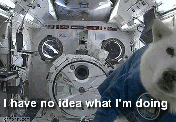

  
<style> code {color: #535353 !important;} </style>
      
```{r setup, include=FALSE}
library(rmarkdown)
knitr::opts_chunk$set(echo = F, error = F, message = F, warning = F)
htmltools::tagList(rmarkdown::html_dependency_font_awesome())
```
 

## Get R!
<hr>

Go to — [Install R](https://mpca-air.github.io/RCamp/00-Install.html) — for instructions on installing the latest version of __R__ and __RStudio__.  
    
    
## Intro to R
<hr>

This series of tutorials teaches the basics of importing data, using new packages, cleaning and summarizing data with __tidy__ tools, and using `ggplot2` to make charts and other data visualizations. 

<div class="row3" style = "margin-top: 20px;">

<div class="column3"><span style="margin-left: 36%;"><i class="fa fa-star" aria-hidden="true" style="color: #f17405;"></i> 
__Day 1__ 
<i class="fa fa-star" aria-hidden="true" style="color: #f17405;"></i></span></div>

<div class="column3"> <span style="margin-left: 36%;><i class="fa fa-star" aria-hidden="true" style="color: #2a5ea9;"></i> 
__Day 2__ 
<i class="fa fa-star" aria-hidden="true" style="color: #2a5ea9;"></i></span></div> 

<div class="column3"> <span style="margin-left: 36%;><i class="fa fa-star" aria-hidden="true" style="color: #fa970c;"></i> 
__Day 3__ 
<i class="fa fa-star" aria-hidden="true" style="color: #fa970c;"></i></span></div>

</div>

<div class="row3">

<div class="column3" style="border: 1px solid grey; height: 270px; max-height: 270px;">

<a href="01-Day1_junk_data.html"></a>

</div>


<div class="column3" style="border: 1px solid grey; height: 270px; max-height: 270px;">

<a href="02_Day2_dplyr_ggplot_part0.html"></a>

</div>


<div class="column3" style="border: 1px solid grey; height: 270px; max-height: 270px;">

<a href="03-Day3_your_turn.html"></a>

</div>
</div>


<div class="row3" style = "margin-top: 30px;">
<div class="column3-txt">

1. Become a a young Jedi scrap scavenger
1. __Project__ launch
    - Create a new project and R script
    - Install new R packages
    - Create variables, lists, data frames
1. __Read data__ into R.
    - Arrange, select and __filter__ data 
    - Mine for errors and outliers
1. Data transformations
    - Add __new columns__ and convert units
    - Summaries and statistics
    - Save data in various formats

Packages: `readr`, `dplyr`  
Planets visited: `Jakku`


</div>

<div class="column3-txt">

1. Data cleaning
1. Group the data
    - Answers for each group and category
1. Make __plots__
    - Scatter plots and box plots
    - Trend lines
    - Add titles, colors, and labels
    - Histograms
1. More __plots__
    - Log transform
    - Reference lines
    - Save charts to different formats
1. Flip tables from wide to long
    
Packages: `ggplot2`, `tidyr`  
Planets visited: `Endor`  

</div> 

<div class="column3-txt">

1. Make __maps__
    - Reading/saving shapefiles
    - Interactive web maps
1. Pull data from __Excel__ and Access
1. Connect to __databases__
    - View tables
    - Read data
1. Save the __porgs__
1. Working with __dates__
    - Time/Twilight zones 
1. __Your data__
    - Create a report
    - Clean your data
    - Chart & map your data
    - Summarize & save

Packages: `readxl`, `leaflet`, `lubridate`  
Planets visited: `Ahch-To` 

</div>
</div>
 
 
## Workshops
<hr>

Each workshop dives into more detail on a common data anlaysis or visualization task. 


<div class="row3" style = "margin-top: 20px;">

<div class="column3">
<a href="01-workshop_tidy.html">
<span style="margin-left: 30%;"><i class="fa fa-cogs" aria-hidden="true" style="color: gray;"></i> 
Tidy data <i class="fa fa-cogs" aria-hidden="true" style="color: gray;"></i> 
</span>
</a></div>

<div class="column3"><span style="margin-left: 32%;"><i class="fa fa-cogs" aria-hidden="true" style="color: white;"></i> 
Writing functions
</span></div> 

<div class="column3"><span style="margin-left: 34%;"> 
Maps and shapefiles
</span></div>

</div>


<div class = "row3">

<div class = "column3" style="height: 190px; max-height: 190px; width: 275px; max-width: 275px; border: 1px solid grey; overflow: hidden;">

<div style="height: 190px; max-height: 190px; width: 275px; max-width: 275px; position: relative;">

<a href="https://mpca-air.github.io/RCamp/01-workshop_tidy.html">

</a>
</div></div></div>


<div class="row3" style="margin-top: 30px;">
<div class="column3">

1. Collapse data spread across many columns.
1. Fill in empty rows from Excel.
1. Reorder ggplots from highest to lowest.
1. Read a whole folder of files at once.
1. Clean spaces and special characters from column names.
1. Parse dates into season, month, quarter, day of the year.
1. Read a set range of cells from Excel.

Packages: `tidyr`, `readxl`, `lubridate`, `forcats`, `ggplot2`

</div></div>


## <i class="fa fa-cogs" aria-hidden="true" style="color: white;"></i>

<br>
